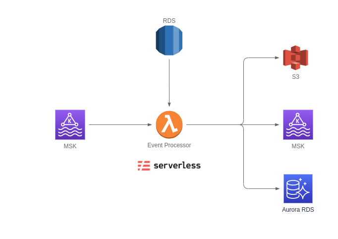

# Serverless Stream Processing AWS MSK - Lambda
Serverless framework based stream processing using Amazon MSK and Amazon Lambda



## Pros & Cons
This framework has several pros and cons as described below:

### Pros
- Easy development and deployment
- Suitable for quick event-based architecture deployment with low-to-medium traffic
- Battle proven by AWS Lambda
- No resource to manage. You can focus totally on logic
- Pay as you use cost, depends on Lambda invocation cost
- Logging by AWS Cloudwatch
- Serverless Framework popularity and many supporting plugins
- It's just simple Python code!

### Cons
- Hard (if not impossible) to test locally, since AWS MSK deployed on secured VPC
- Only two consumer group message available, since the beginning of topic (TRIM_HORIZON) and LATEST
- Not suitable for high traffic topic
- Sometimes deployment and removal takes quite long time

## Project Directory Structures

```bash
.
├── apps/                                       # Applications directory
│   └── demo-walkthrough/                       # Single deployable event processing application
│       ├── data/
│       ├── venv/                               # Python virtual environment (ignored by .gitignore)
│       ├── env.dev.json                        # Serverless Variables for stage dev (ignored by .gitignore)
│       ├── env.example.json                    # Example of Serverless Variables
│       ├── handler.py                          # Serverless default handler (created after serverless create)
│       ├── __init__.py
│       ├── p01OrdersEnrichCustomerLocation.py  # Serverless function handler subscribes for a specific Kafka topic
│       ├── package.json                        # Serverless dependencies and plugins declaration
│       ├── package-lock.json
│       ├── requirements.txt                    # Python dependencies
│       ├── serverless.yml                      # Serverless service definition
│       └── walkthrough.md
├── utils/                                      # Utilities Python modules
│   ├── db.py                                   # DB access functions based on SQLAlchemy
│   ├── __init__.py
│   ├── kafka.py                                # Kafka helper functions
│   └── msk.py                                  # MSK specific helper functions
└── visualization (TODO)
```

TODO
